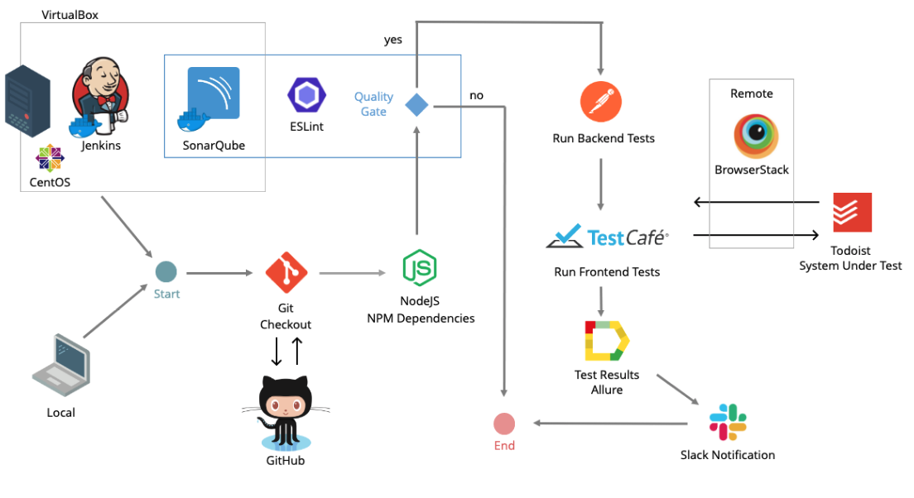

## Wizeline QA Buddy Program - Alejandro Serrano
This repository contains the implementation of a Proof of concept which includes backend and frontend automated test cases. The System Under Test is the [Todoist](https://todoist.com/) website. This excercise is part of the QA Buddy Program at Wizeline. The intention of the challenge is to learn new technologies, apply our knowledge, and have fun.

Presentation: [QA Buddy Program - Alejandro Serrano](https://slides.com/alejandro-serrano/wizeline-qa-buddy-program/fullscreen) (Hint: use your keyboard arrow keys to navigate through the presentation)<br>
Wiki: Still Under Construction...

## Table of contents
 * [Getting Started](#getting-started)<br>
 * [Cleaning up the environment](#cleaning-up-the-environment)<br>
 * [Lint your code](#lint-your-code)<br>
 * [Running the backend tests](#running-the-backend-tests)<br>
 * [Backend demo](#backend-demo)<br>
 * [Running the frontend tests](#running-the-frontend-tests)<br>
 * [Frontend demo](#frontend-demo)<br>
 * [High level tools interaction](#high-level-tools-interaction)

## Getting Started
1. Ensure that [Node.js](https://nodejs.org/en/) and npm are installed on your computer.
2. Clone this repository or download the zip with the source code in to your local system.
```
git clone git@github.com:wizeline/qa-buddy-program-alejandro-serrano.git
```
3. Change directory to the folder where the code of this project lives in your local system.
4. Install dependencies.
```
npm install
```

## Cleaning up the environment
1. Run the following command to clean up your local environment. It will delete all the previous executions reports if they exist.
```
npm run clean
```

## Lint your code
1. Run the following command to perform a code analysis to identify problematic patterns found in JavaScript code.
```
npm run lint
```
2. An ESLint report in HTML will be generated at the following path within your project: `qa-buddy-program-alejandro-serrano/reports/eslint/eslint.html`

## Running the backend tests
1. Run the following command to execute the backend tests.
```
npm run backend
```
2. Once the execution finishes, run the following command to generate the Test Execution Report.
```
npm run backend-gen-report
```
3. Finally, run the following command to open the Test Execution Report.
```
npm run backend-publish-report
```

## Backend demo


## Running the frontend tests

Prerequisite:
* Make sure to follow the instructions in the `env/.env_template` file to provide your todoist credentials before running the test cases.

1. Run the following command to execute the frontend tests.
```
npm run frontend
```
2. Once the execution finishes, run the following command to generate the Test Execution Report.
```
npm run frontend-gen-report
```
3. Finally, run the following command to open the Test Execution Report.
```
npm run backend-publish-report
```

## Frontend demo


## High level tools interaction

